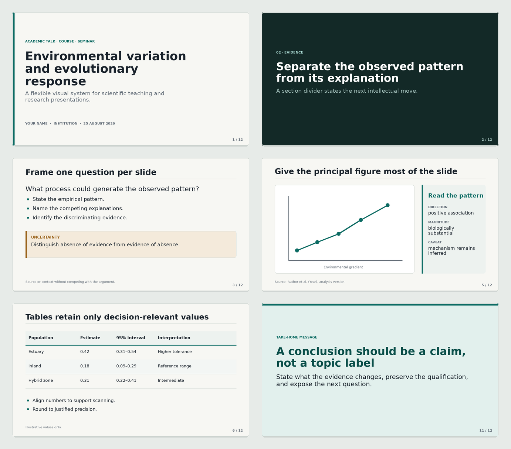

# Fieldnote Academic

**Fieldnote Academic** is a minimalist academic presentation theme for the [Slides Extended](https://github.com/ebullient/obsidian-slides-extended) Obsidian plugin and Reveal.js.

It is designed for scientific and university presentations where the content should dominate the visual design: lectures, seminars, conference talks, lab meetings, methods presentations, figures, equations, code, quotations, and evidence-rich slides.



## Design principles

Fieldnote Academic uses a warm-white canvas, graphite typography, a restrained deep-teal accent, generous whitespace, and dark section dividers. The system is intentionally quiet: it provides visual hierarchy without competing with figures, data, or argumentation.

The initial release includes title slides, section dividers, ordinary content slides, figure-focused layouts, comparison layouts, take-home slides, questions slides, compact/dense variants, tables, equations, code, callouts, quotations, captions, and source lines.

## Quick start

1. Copy `assets/css/fieldnote-academic.css` and the optional `templates/` directory into your Slides Extended assets directory.
2. Set the deck theme in YAML frontmatter:

```yaml
theme: fieldnote-academic.css
width: 1280
height: 720
center: false
```

3. Use `fieldnote-starter-deck.md` as a starting point and `fieldnote-pattern-library.md` as a copy-and-paste layout reference.

See [docs/USAGE.md](docs/USAGE.md) for installation details and customization guidance.

## Repository contents

- `assets/css/fieldnote-academic.css` — the theme
- `templates/` — optional Slides Extended layout templates
- `fieldnote-starter-deck.md` — example deck
- `fieldnote-pattern-library.md` — reusable slide patterns
- `preview-contact-sheet.png` — visual overview
- `docs/USAGE.md` — detailed usage notes

## Compatibility

Fieldnote Academic targets Slides Extended and the Reveal.js runtime bundled by that plugin. It is intended to remain local-first: the theme does not require remote fonts, JavaScript, or external design dependencies.

## Versioning

This repository uses semantic version tags. Historical versions can be checked out directly by tag.

## License

Fieldnote Academic is released under the [MIT License](LICENSE).
